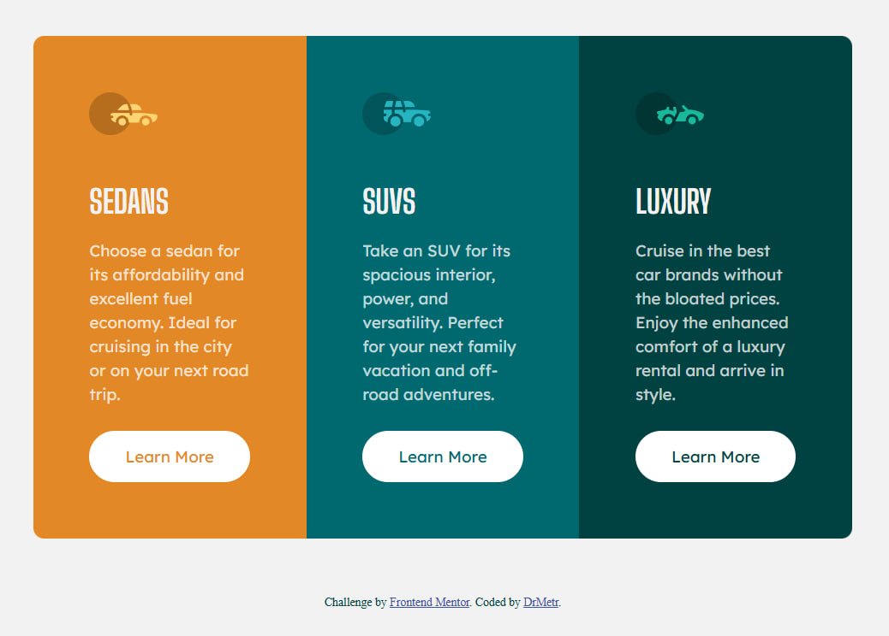

# Frontend Mentor - 3-column preview card component solution

This is a solution to the [3-column preview card component challenge on Frontend Mentor](https://www.frontendmentor.io/challenges/3column-preview-card-component-pH92eAR2-). Frontend Mentor challenges help you improve your coding skills by building realistic projects. 

## Table of contents

- [Overview](#overview)
  - [The challenge](#the-challenge)
  - [Screenshot](#screenshot)
  - [Links](#links)
- [My process](#my-process)
  - [Built with](#built-with)
  - [What I learned](#what-i-learned)
  - [Continued development](#continued-development)
  - [Useful resources](#useful-resources)
- [Author](#author)

## Overview

### The challenge

Users should be able to:

- View the optimal layout depending on their device's screen size
- See hover states for interactive elements

### Screenshot

![]

### Links

- Solution URL: [Add solution URL here](https://your-solution-url.com)
- Live Site URL: [Add live site URL here](https://your-live-site-url.com)

## My process

### Built with

- Semantic HTML5 markup
- CSS custom properties
- Flexbox
- CSS Grid
- Mobile-first workflow

### What I learned

Solving this challenge I didn't use anything particularly new however I learned that media queries property can be included within a css property instead of typing it on its own and include all the properties needed in it. A always, I added transitions to my taste.

The most challenging part was "Learn more" buttons. I didn't find any elegant easy ways that would allow me avoid repetition in styles.css file. And also for some reason the text of those wouldn't change from transparent to white upon mouse hover when I include "color: white;" property into .button:hover, so I had to include the same line in each of three cards. I wonder why does this happen?

### Continued development

I'm interested in applying SASS or Tailwind next time.
For now I solve challenges that don't require JavaScript because after W3schools and web.dev introductory courses covering basics I am unsure I understand this language enough and I feel need in more proper explanations and exploration that I hope to find in "Eloquent JavaScript" by Marijn Haverbeke.

### Useful resources

- [Aligning items in a flex container](https://developer.mozilla.org/en-US/docs/Web/CSS/CSS_flexible_box_layout/Aligning_items_in_a_flex_container) - This MDN page helped me undertand differences between flexbox properties that seem to do the same job but they don't.

## Author

- Website - [DrMetr](https://github.com/DrMetr)
- Frontend Mentor - [@DrMetr](hhttps://www.frontendmentor.io/profile/DrMetr)
